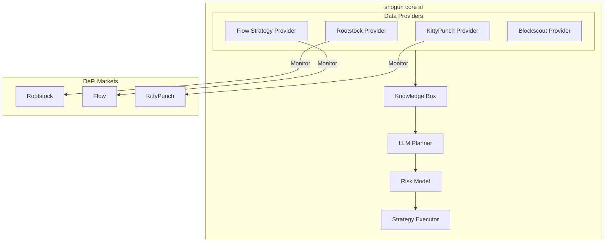

# shogun core ai

An AI-powered DeFi strategy agent that generates and executes vault strategies using LLM-based planning and risk assessment. shogun core ai specializes in cross-protocol yield optimization across Rootstock and Flow ecosystems.

## System Overview



For a detailed view of the system architecture, including strategy flows, risk assessment, and monitoring parameters, see our [shogun core ai Architecture Documentation](docs/SHOGUN_CORE_AI_ARCHITECTURE.md).

## Overview

shogun core ai is a deterministic AI system that:
- Monitors and executes strategies across Rootstock and Flow ecosystems
- Implements cross-protocol yield optimization
- Uses LLM-based planning for strategy generation
- Employs multi-layered risk assessment
- Executes approved strategies with multi-sig security

## Core Strategies

### Rootstock Strategy
- BTC lending on Sovryn
- DLLR/BTC pool liquidity provision
- Leverage optimization
- Liquidation risk monitoring

### Flow Strategy
- MORE Markets borrowing
- KittyPunch lending integration
- Token reward optimization
- Protocol health monitoring

## Project Structure

```
📁 shogun-core-ai/
├── 📂 src/                    # Source code
│   ├── 📂 agent/             # Core agent logic
│   │   ├── llm_planner.py    # Strategy generation
│   │   ├── risk_model.py     # Risk assessment
│   │   └── knowledge_box.py  # Historical data
│   ├── 📂 data_providers/    # Protocol integrations
│   │   ├── rootstock.py      # Rootstock protocol
│   │   ├── flow_strategy.py  # Flow Strategy
│   │   ├── kitty_punch.py    # KittyPunch
│   │   └── blockscout.py     # Event monitoring
│   ├── 📂 execution/         # On-chain execution
│   └── main.py               # Main orchestration
├── 📂 docs/                  # Documentation
│   └── SHOGUN_CORE_AI_ARCHITECTURE.md  # System architecture
├── 📂 configs/               # Configuration files
└── requirements.txt          # Dependencies
```

## Risk Assessment

shogun core ai employs a multi-layered risk assessment system:

1. **Protocol Risk**
   - TVL monitoring
   - Liquidity depth analysis
   - Smart contract risk scoring
   - Historical pattern matching

2. **Market Risk**
   - Volatility tracking
   - Price impact analysis
   - Slippage protection
   - Liquidation risk assessment

3. **Execution Risk**
   - Gas optimization
   - Transaction sequencing
   - Multi-sig verification
   - Rate limiting

For detailed risk assessment flows and monitoring parameters, refer to the [Risk Assessment section](docs/SHOGUN_CORE_AI_ARCHITECTURE.md#risk-assessment) in our architecture documentation.

## Setup

1. Install dependencies:
```bash
pip install -r requirements.txt
```

2. Configure environment:
- Copy `.env.example` to `.env`
- Add your API keys and RPC endpoints:
  - Rootstock RPC
  - Flow RPC
  - OpenRouter API key

3. Configure protocols:
Edit `configs/config.yaml` to set:
- Protocol addresses
- Risk thresholds
- Monitoring parameters
- LLM settings

4. Run the agent:
```bash
python src/main.py
```

## Security Features

- **Deterministic Execution**: No randomness in strategy generation
- **Multi-sig Protection**: All transactions require multiple signatures
- **Risk Scoring**: Every strategy is scored before execution
- **Real-time Monitoring**: Continuous protocol health checks
- **Emergency Shutdown**: Automatic response to unusual events

For detailed security measures and implementation, see the [Security Measures section](docs/SHOGUN_CORE_AI_ARCHITECTURE.md#security-measures) in our architecture documentation.

## Protocol Integrations

### Rootstock
- Sovryn lending pools
- DLLR/BTC liquidity pools
- Blockscout event monitoring

### Flow
- MORE Markets protocol
- KittyPunch lending
- Flow Strategy vaults

For detailed protocol integration flows and monitoring strategies, see the [Strategy Flow section](docs/SHOGUN_CORE_AI_ARCHITECTURE.md#strategy-flow) in our architecture documentation.

## Monitoring

shogun core ai monitors:
- Liquidity events
- Volume spikes
- Rate changes
- Protocol health metrics
- Smart contract events
- Market conditions

For a comprehensive view of our monitoring system and real-time parameters, check the [Monitoring Parameters section](docs/SHOGUN_CORE_AI_ARCHITECTURE.md#monitoring-parameters) in our architecture documentation.

## License

MIT 
