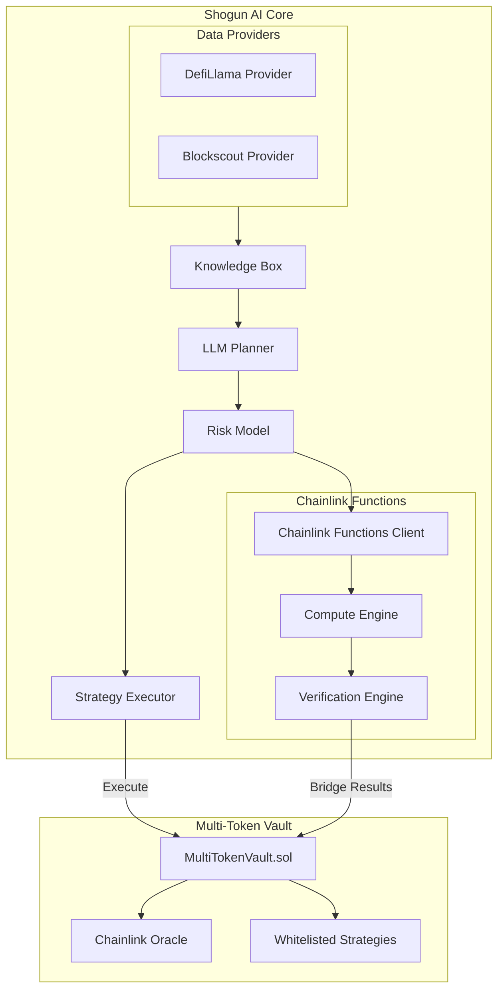

# Shogun AI Core

An AI-powered DeFi strategy agent that generates and executes vault strategies using LLM-based planning and risk assessment. Shogun AI Core specializes in cross-protocol yield optimization through a secure Multi-Token Vault system with **Chainlink Functions** integration for verifiable offchain computation.

## 🚀 Quick Start

### Option 1: Docker (Recommended)
```bash
# Build and test Chainlink Functions locally
./run_docker.sh build
./run_docker.sh test

# Deploy to blockchain (requires subscription ID)
./deploy_to_blockchain.sh sepolia YOUR_SUBSCRIPTION_ID
```

### Option 2: Local Development
```bash
# Install dependencies
pip install -r requirements.txt

# Configure environment
cp .env.example .env
# Edit .env with your API keys

# Run the agent
python src/main.py
```

## System Overview



For a detailed view of the system architecture, including strategy flows, risk assessment, and monitoring parameters, see our [Shogun AI Core Architecture Documentation](docs/SHOGUN_CORE_AI_ARCHITECTURE.md).

## Overview

Shogun AI Core is a deterministic AI system that:
- Manages strategies through a secure Multi-Token Vault
- Implements cross-protocol yield optimization
- Uses LLM-based planning for strategy generation
- Employs multi-layered risk assessment
- Executes approved strategies through whitelisted contracts
- **Leverages Chainlink Functions for verifiable offchain computation**

## Core Components

### Multi-Token Vault (MultiTokenVault.sol)
- Accepts multiple ERC20 tokens (USDC, WBTC, WETH, LINK)
- Chainlink oracle integration for reliable price feeds
- Automatic token conversion to USDC equivalent
- Advanced multi-asset management with precise pricing

### Strategy System
- Whitelisted strategy contracts
- AI agent execution through secure interfaces
- Harvest and emergency exit capabilities
- Transparent fund management

### Chainlink Functions Integration
- **Strategy Risk Scoring**: Offchain ML model inference with verifiable proofs
- **Cross-Chain APY Aggregation**: Multi-chain data fetching and analysis
- **Vault Allocation Optimization**: Complex optimization algorithms with cryptographic verification
- **Oracle Health Monitoring**: Real-time Chainlink oracle health checks

## Project Structure

```
📁 shogun-ai-core/
├── 📂 src/                    # Source code
│   ├── 📂 agent/             # Core agent logic
│   │   ├── llm_planner.py    # Strategy generation
│   │   ├── risk_model.py     # Risk assessment
│   │   └── knowledge_box.py  # Historical data
│   ├── 📂 data_providers/    # Protocol integrations
│   │   ├── defillama_provider.py  # DefiLlama data
│   │   └── blockscout.py     # Event monitoring
│   ├── 📂 execution/         # On-chain execution
│   ├── 📂 serverless/        # Chainlink Functions integration
│   │   ├── functions_client.py    # Chainlink Functions client
│   │   ├── compute_engine.py      # Task orchestration
│   │   ├── verification.py        # Result verification
│   │   └── functions/             # JavaScript functions
│   └── main.py               # Main orchestration
├── 📂 docs/                  # Documentation
│   ├── SHOGUN_CORE_AI_ARCHITECTURE.md  # System architecture
│   └── SERVERLESS_INTEGRATION.md       # Chainlink Functions guide
├── 📂 configs/               # Configuration files
├── 📂 contracts/             # Smart contracts
├── 📂 deployment_functions/  # Functions ready for deployment
├── Dockerfile                # Docker configuration
├── docker-compose.yml        # Docker orchestration
├── run_docker.sh            # Docker management script
├── deploy_to_blockchain.sh  # Blockchain deployment script
└── requirements.txt          # Dependencies
```

## 🐳 Docker Setup

### Prerequisites
- Docker Desktop installed and running
- Chainlink Functions subscription (get one at [functions.chain.link](https://functions.chain.link))

### Quick Commands
```bash
# Build the Docker image
./run_docker.sh build

# Test functions locally
./run_docker.sh test

# Open shell in container
./run_docker.sh shell

# Deploy to blockchain (requires subscription ID)
./deploy_to_blockchain.sh sepolia YOUR_SUBSCRIPTION_ID

# Clean up
./run_docker.sh clean
```

### What Each Command Does
- `build`: Creates Docker image with Node.js and all dependencies
- `test`: Runs your Chainlink Functions locally to verify they work
- `shell`: Opens interactive shell in the container for development
- `deploy`: Prepares functions for blockchain deployment
- `clean`: Removes containers and images

## 🔗 Chainlink Functions Deployment

### Step 1: Get Your Subscription
1. Go to [functions.chain.link](https://functions.chain.link)
2. Sign up/login to your account
3. Create a subscription and add LINK tokens (1-2 LINK minimum)
4. Copy your subscription ID

### Step 2: Deploy Your Functions
```bash
# Deploy to testnet (FREE)
./deploy_to_blockchain.sh sepolia YOUR_SUBSCRIPTION_ID

# Deploy to mainnet (COSTS MONEY)
./deploy_to_blockchain.sh avalanche YOUR_SUBSCRIPTION_ID
```

### Step 3: Manual Deployment via Web Dashboard
The script will prepare your functions in the `deployment_functions/` folder. Then:

1. Go to [functions.chain.link](https://functions.chain.link)
2. Click "Create Function"
3. Select your network and subscription
4. Copy-paste the function code from `deployment_functions/`
5. Click "Deploy"
6. Note down the Function ID

### Step 4: Update Configuration
Update `chainlink_functions_deployed.yaml` with your function IDs.

### Step 5: Test and Integrate
- Test functions in the Chainlink dashboard
- Integrate function IDs into your smart contracts
- Monitor LINK consumption

## Risk Assessment

Shogun AI Core employs a multi-layered risk assessment system:

1. **Protocol Risk**
   - TVL monitoring
   - Liquidity depth analysis
   - Smart contract risk scoring
   - Historical pattern matching

2. **Market Risk**
   - Volatility tracking
   - Price impact analysis
   - Slippage protection
   - Liquidation risk assessment

3. **Execution Risk**
   - Gas optimization
   - Transaction sequencing
   - Multi-sig verification
   - Rate limiting

4. **Chainlink Functions Risk**
   - Offchain computation verification
   - Cryptographic proof validation
   - Oracle health monitoring
   - Cross-chain data integrity

For detailed risk assessment flows and monitoring parameters, refer to the [Risk Assessment section](docs/SHOGUN_CORE_AI_ARCHITECTURE.md#risk-assessment) in our architecture documentation.

## Setup

### Option 1: Docker (Recommended)
```bash
# 1. Build and test
./run_docker.sh build
./run_docker.sh test

# 2. Deploy to blockchain
./deploy_to_blockchain.sh sepolia YOUR_SUBSCRIPTION_ID

# 3. Follow deployment instructions
```

### Option 2: Local Development
1. Install dependencies:
```bash
pip install -r requirements.txt
```

2. Configure environment:
- Copy `.env.example` to `.env`
- Add your API keys and RPC endpoints:
  - Ethereum RPC
  - DefiLlama API key
  - OpenRouter API key
  - **Chainlink Functions subscription ID**
  - **Private key for onchain bridging**

3. Configure protocols:
Edit `configs/config.yaml` to set:
- Vault addresses
- Strategy contract addresses
- Risk thresholds
- Monitoring parameters
- LLM settings
- **Chainlink Functions configuration**

4. Run the agent:
```bash
python src/main.py
```

## Chainlink Functions Integration

### What is Chainlink Functions?
Chainlink Functions is a serverless platform that allows you to run custom JavaScript code offchain with verifiable results that can be bridged back onchain.

### Use Cases in Shogun AI Core:

1. **Strategy Risk Scoring**
   ```python
   # Submit risk scoring to Chainlink Functions
   task_id = await chainlink_engine.submit_strategy_risk_scoring_task({
       'strategy_address': '0x1234...',
       'tokens': ['USDC', 'WETH', 'AVAX'],
       'current_allocation': 0.3,
       'max_allocation': 0.4,
       'risk_score': 0.25
   })
   ```

2. **Cross-Chain APY Aggregation**
   ```python
   # Fetch APY data from multiple chains
   response = await chainlink_engine.submit_cross_chain_apy_task([
       '0x794a61358D6845594F94dc1DB02A252b5b4814aD',  # Aave V3
       '0x5C0401e81Bc07Ca70fAD469b451682c0d747Ef1c',  # Benqi
       '0x9Ad6C38BE94206cA50bb0d90783181662f0Cfa10'   # Trader Joe
   ])
   ```

3. **Vault Allocation Optimization**
   ```python
   # Optimize vault allocation
   allocation = await chainlink_engine.submit_allocation_optimization_task({
       'current_allocations': {...},
       'strategy_constraints': {...},
       'total_value_locked': 1000000,
       'risk_tolerance': 0.3
   })
   ```

For detailed Chainlink Functions integration guide, see [Chainlink Functions Integration](docs/SERVERLESS_INTEGRATION.md).

## Security Features

- **Deterministic Execution**: No randomness in strategy generation
- **Multi-sig Protection**: All transactions require multiple signatures
- **Risk Scoring**: Every strategy is scored before execution
- **Real-time Monitoring**: Continuous protocol health checks
- **Emergency Shutdown**: Automatic response to unusual events
- **Whitelisted Strategies**: Only approved contracts can execute
- **Oracle Integration**: Reliable price feeds for accurate valuations
- **Chainlink Functions Verification**: Cryptographic proof validation for offchain computations
- **Cross-Chain Data Integrity**: Verifiable multi-chain data aggregation

For detailed security measures and implementation, see the [Security Measures section](docs/SHOGUN_CORE_AI_ARCHITECTURE.md#security-measures) in our architecture documentation.

## Vault Management

### Multi-Token Support
- USDC: Primary stablecoin for calculations
- WBTC: Bitcoin exposure with oracle pricing
- WETH: Ethereum exposure with real-time feeds
- LINK: Chainlink token integration

### Strategy Execution
- AI agent generates optimal strategies
- Risk model validates all proposals
- **Chainlink Functions provides offchain computation**
- Whitelisted contracts execute approved strategies
- Automatic harvesting and rebalancing
- Emergency exit capabilities for risk management

For detailed vault management flows and monitoring strategies, see the [Strategy Flow section](docs/SHOGUN_CORE_AI_ARCHITECTURE.md#strategy-flow) in our architecture documentation.

## Monitoring

Shogun AI Core monitors:
- Vault performance metrics
- Strategy execution status
- Oracle price feeds
- Liquidity events
- Volume spikes
- Rate changes
- Protocol health metrics
- Smart contract events
- Market conditions
- **Chainlink Functions task status**
- **Oracle health across networks**
- **Cross-chain data integrity**

For a comprehensive view of our monitoring system and real-time parameters, check the [Monitoring Parameters section](docs/SHOGUN_CORE_AI_ARCHITECTURE.md#monitoring-parameters) in our architecture documentation.

## 💰 Costs

### Testnet Deployment
- **FREE** (limited usage)
- Perfect for development and testing

### Mainnet Deployment
- **Deployment**: ~0.1-0.5 LINK per function
- **Execution**: ~0.01-0.05 LINK per call
- **Monthly**: ~1-10 LINK depending on usage

## 🆘 Troubleshooting

### Common Issues

**Docker not running**
```bash
# Start Docker Desktop first
open -a Docker
```

**Function deployment fails**
- Check your subscription has sufficient LINK
- Verify JavaScript syntax
- Check network connectivity

**CLI not found**
- Chainlink Functions uses web dashboard, not CLI
- Use the deployment script to prepare files

### Getting Help
- 📖 [Full Deployment Guide](src/serverless/functions/DEPLOYMENT.md)
- 📖 [Integration Documentation](docs/SERVERLESS_INTEGRATION.md)
- 🔗 [Chainlink Functions Docs](https://docs.chain.link/chainlink-functions)

## License

MIT 
