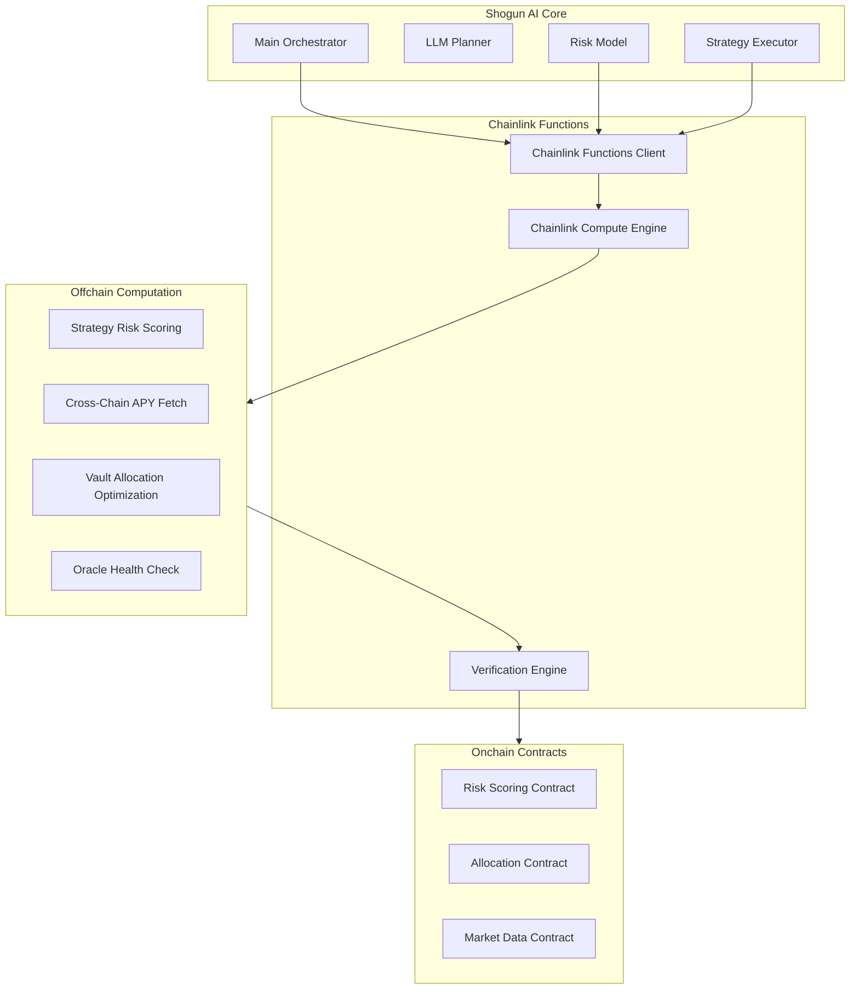

# Chainlink Functions Integration

## Overview

The Shogun AI Core now integrates with **Chainlink Functions** to provide **verifiable offchain computation** that can be bridged back onchain. This enables:

- **Offchain ML model inference** for strategy risk scoring
- **Cross-chain APY aggregation** from multiple protocols
- **Vault allocation optimization** with cryptographic proofs
- **Oracle health monitoring** for reliability
- **Verifiable computation integrity** for onchain contracts

## Architecture



## Key Components

### 1. Chainlink Functions Client (`src/serverless/functions_client.py`)

Interfaces with Chainlink Functions to:
- Submit JavaScript function source code
- Execute ML model inference
- Fetch cross-chain data
- Verify computation results

**Key Methods:**
- `run_strategy_risk_scoring()` - Execute ML risk scoring via Chainlink Functions
- `fetch_cross_chain_apy()` - Aggregate APY data from multiple chains
- `optimize_vault_allocation()` - Run vault allocation optimization
- `check_oracle_health()` - Monitor Chainlink oracle health

### 2. Chainlink Compute Engine (`src/serverless/compute_engine.py`)

Orchestrates Chainlink Functions computations:
- Manages task queues and priorities
- Handles concurrent execution
- Provides fallback mechanisms
- Tracks performance metrics

**Key Features:**
- Priority-based task scheduling
- Concurrent task execution (configurable)
- Automatic retry mechanisms
- Performance monitoring and statistics

### 3. Verification Engine (`src/serverless/verification.py`)

Handles cryptographic verification and onchain bridging:
- Verifies computation results
- Bridges results to smart contracts
- Maintains audit trails
- Ensures computation integrity

**Key Methods:**
- `verify_computation_proof()` - Cryptographic proof verification
- `bridge_risk_score_onchain()` - Bridge risk scores to contracts
- `bridge_allocation_proposal_onchain()` - Bridge allocation proposals
- `bridge_market_data_onchain()` - Bridge market data

## Use Cases

### 1. Strategy Risk Scoring via Chainlink Functions

**Problem:** ML risk models are computationally expensive and can't run efficiently onchain.

**Solution:** Run risk scoring via Chainlink Functions with verifiable proofs.

```python
# Submit strategy risk scoring task
task_id = await chainlink_engine.submit_strategy_risk_scoring_task(
    strategy_data={
        'strategy_address': '0x1234567890123456789012345678901234567890',
        'tokens': ['USDC', 'WETH', 'AVAX'],
        'current_allocation': 0.3,
        'max_allocation': 0.4,
        'risk_score': 0.25
    }
)

# Result includes verification hash
result_data = status['result']  # JSON string
result = json.loads(result_data)
risk_score = result['risk_score']  # 0.85
verification_hash = result['verification_hash']
```

### 2. Cross-Chain APY Aggregation

**Problem:** Need to compare APYs across multiple chains and protocols.

**Solution:** Fetch and aggregate data via Chainlink Functions with verification.

```python
# Fetch APY data from multiple chains
response = await chainlink_engine.submit_cross_chain_apy_task([
    '0x794a61358D6845594F94dc1DB02A252b5b4814aD',  # Aave V3
    '0x5C0401e81Bc07Ca70fAD469b451682c0d747Ef1c',  # Benqi
    '0x9Ad6C38BE94206cA50bb0d90783181662f0Cfa10'   # Trader Joe
])

# Aggregated results with verification
result_data = response.result.decode()
apy_data = json.loads(result_data)['apy_data']
verification_hash = json.loads(result_data)['verification_hash']
```

### 3. Vault Allocation Optimization

**Problem:** Complex optimization algorithms can't run onchain due to gas limits.

**Solution:** Run optimization via Chainlink Functions and bridge the proposal.

```python
# Optimize vault allocation
allocation = await chainlink_engine.submit_allocation_optimization_task({
    'current_allocations': {
        'strategy_1': 0.3,
        'strategy_2': 0.4,
        'strategy_3': 0.3
    },
    'strategy_constraints': {
        'strategy_1': {'max_allocation': 0.4, 'risk_score': 0.2},
        'strategy_2': {'max_allocation': 0.5, 'risk_score': 0.3},
        'strategy_3': {'max_allocation': 0.3, 'risk_score': 0.4}
    },
    'total_value_locked': 1000000,
    'risk_tolerance': 0.3
})

# Bridge optimal allocation onchain
tx_hash = verification_engine.bridge_allocation_proposal_onchain(
    allocation, verification_hash, 'vault_001'
)
```

## Configuration

### Environment Variables

Set these environment variables for Chainlink Functions:

```bash
# Chainlink Functions subscription
export CHAINLINK_SUBSCRIPTION_ID="your_subscription_id"

# API credentials
export DEFILLAMA_API_KEY="your_defillama_api_key"

# Onchain bridging
export PRIVATE_KEY="your_private_key_for_transactions"
```

### Configuration File

The Chainlink Functions settings are configured in `configs/config.yaml`:

```yaml
chainlink_functions:
  # Network configuration
  network: "avalanche"
  
  # Chainlink Functions subscription
  subscription_id: "${CHAINLINK_SUBSCRIPTION_ID}"
  
  # API credentials
  defillama_api_key: "${DEFILLAMA_API_KEY}"
  
  # Oracle health monitoring
  oracle_deviation_threshold: 0.02
  
  # Compute engine settings
  max_concurrent_tasks: 5
  verification_timeout: 300
  max_retries: 3
  
  # Onchain bridging configuration
  rpc_url: "https://api.avax.network/ext/bc/C/rpc"
  private_key: "${PRIVATE_KEY}"
  
  # Smart contract addresses for bridging results
  contracts:
    risk_scoring: "0x1234567890123456789012345678901234567890"
    allocation: "0x2345678901234567890123456789012345678901"
    market_data: "0x3456789012345678901234567890123456789012"
```

## Chainlink Functions

### Strategy Risk Scoring Function

Located in `src/serverless/functions_client.py`:

- **Input:** Strategy address, tokens, allocation, risk score
- **Output:** Enhanced risk score, risk factors, verification hash
- **Features:** Multi-factor risk assessment, allocation-based scoring

### Cross-Chain APY Function

Fetches and aggregates APY data from multiple chains:

- **Input:** Strategy addresses, target chains
- **Output:** Aggregated APY data, cross-chain comparisons
- **Features:** Multi-chain data aggregation, DeFiLlama integration

### Vault Allocation Optimization Function

Runs vault allocation optimization algorithms:

- **Input:** Current allocations, constraints, TVL, risk tolerance
- **Output:** Optimal allocation proposal, expected performance
- **Features:** Risk-adjusted optimization, constraint satisfaction

### Oracle Health Check Function

Monitors Chainlink oracle health:

- **Input:** Oracle addresses, deviation threshold
- **Output:** Oracle health status, deviation metrics
- **Features:** Real-time monitoring, health scoring

## Security & Verification

### Cryptographic Proofs

Every Chainlink Functions computation generates a verification hash:

1. **Input Processing:** Process the function arguments
2. **Computation Execution:** Run the JavaScript function
3. **Result Hashing:** Create a hash of the output result
4. **Verification Hash:** Generate a hash linking input to output
5. **Onchain Verification:** Verify the hash onchain before accepting results

### Onchain Verification

Smart contracts verify computation integrity:

```solidity
function updateRiskScore(
    address strategy,
    uint256 riskScore,
    bytes32 verificationHash
) external {
    require(verifyComputationHash(strategy, riskScore, verificationHash), "Invalid verification");
    // Update risk score
}
```

### Audit Trail

All computations are logged for audit purposes:

- Computation timestamps
- Input/output hashes
- Verification results
- Onchain transaction hashes

## Performance & Monitoring

### Metrics Tracked

- **Task Submission Rate:** Tasks submitted per minute
- **Completion Rate:** Successful task completions
- **Average Compute Time:** Time to complete tasks
- **Verification Success Rate:** Hash verification success
- **Onchain Bridge Success:** Successful onchain transactions

### Monitoring Dashboard

```python
# Get Chainlink Functions compute engine statistics
stats = chainlink_engine.get_stats()
print(f"Tasks completed: {stats['tasks_completed']}")
print(f"Success rate: {stats['tasks_completed'] / stats['tasks_submitted']}")
print(f"Average compute time: {stats['avg_compute_time']:.2f}s")

# Get verification statistics
verification_stats = verification_engine.get_verification_stats()
print(f"Verification success rate: {verification_stats['success_rate']:.2%}")
```

## Deployment

### 1. Deploy Chainlink Functions

Deploy the JavaScript functions to Chainlink Functions:

```bash
# Deploy strategy risk scoring function
chainlink functions deploy --source src/serverless/functions/strategy_risk_scoring.js

# Deploy cross-chain APY function
chainlink functions deploy --source src/serverless/functions/cross_chain_apy.js

# Deploy allocation optimization function
chainlink functions deploy --source src/serverless/functions/allocation_optimization.js
```

### 2. Configure Smart Contracts

Deploy the onchain contracts for receiving verified results:

```solidity
// Risk scoring contract
contract RiskScoringContract {
    function updateRiskScore(address strategy, uint256 score, bytes32 verificationHash) external;
}

// Allocation contract
contract AllocationContract {
    function proposeAllocation(bytes32 vaultId, address[] strategies, uint256[] weights, bytes32 verificationHash) external;
}
```

### 3. Update Configuration

Set the subscription ID and contract addresses in your configuration:

```yaml
chainlink_functions:
  subscription_id: "deployed_subscription_id"
  
  contracts:
    risk_scoring: "deployed_contract_address"
    allocation: "deployed_contract_address"
    market_data: "deployed_contract_address"
```

## Benefits

### For Shogun AI Core

1. **Scalable Computation:** Run complex ML models without gas constraints
2. **Cross-Chain Data:** Aggregate data from multiple chains efficiently
3. **Verifiable Results:** Cryptographic hashes ensure computation integrity
4. **Cost Effective:** Pay only for computation used
5. **Reliable:** Chainlink network handles infrastructure

### For Users

1. **Transparent:** All computations are verifiable and auditable
2. **Efficient:** Faster execution than onchain alternatives
3. **Secure:** Cryptographic hashes prevent tampering
4. **Cost Effective:** Lower gas costs for complex operations
5. **Reliable:** Chainlink Functions handles infrastructure

## Future Enhancements

1. **Zero-Knowledge Proofs:** Add ZK proofs for privacy-preserving computations
2. **Multi-Network Support:** Support for multiple Chainlink networks
3. **Advanced ML Models:** Integration with more sophisticated ML frameworks
4. **Real-time Streaming:** Real-time data streaming and analysis
5. **Decentralized Oracles:** Integration with additional oracle networks 