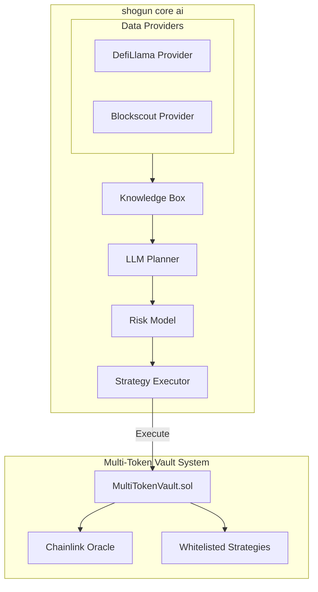
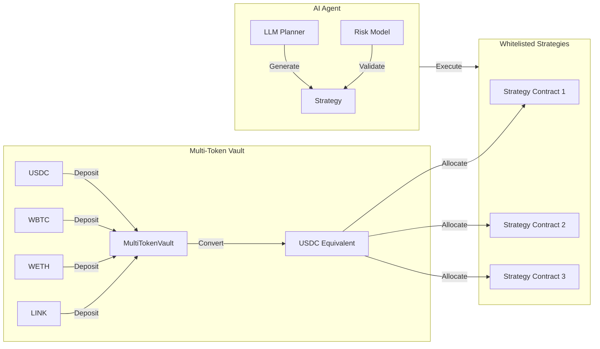
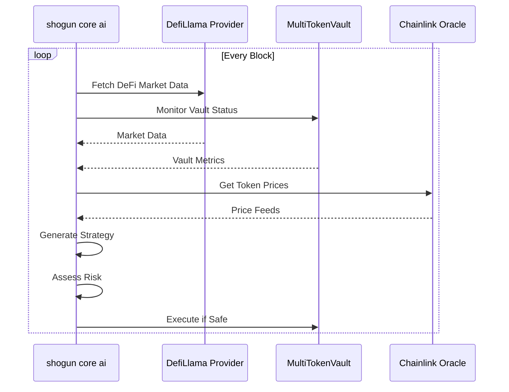
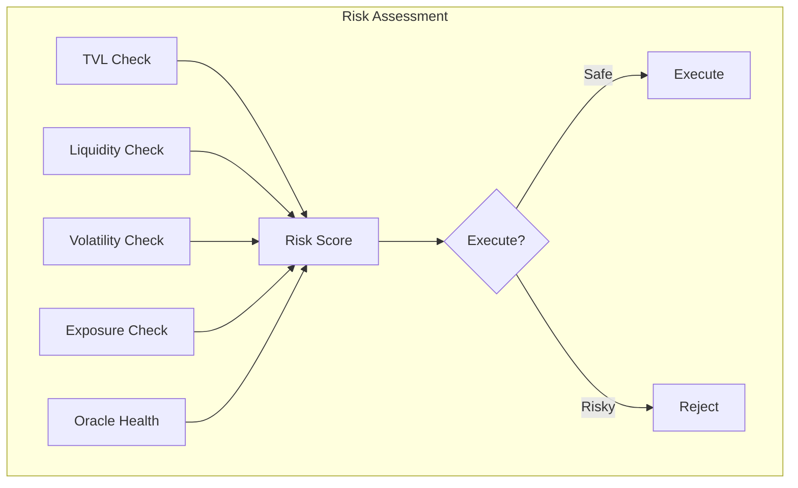
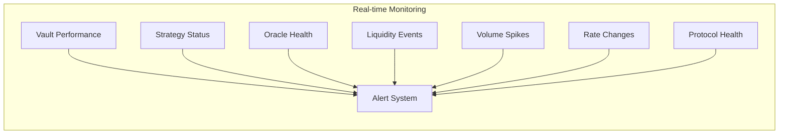
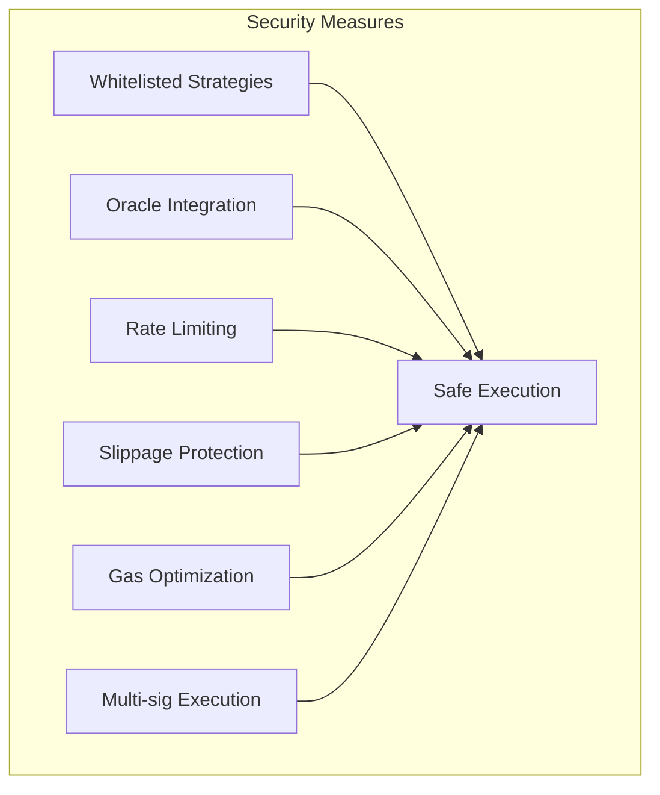

# shogun core ai Architecture

## System Overview

## Strategy Flow

## Data Flow

## Risk Assessment

## Core Components

### Multi-Token Vault (MultiTokenVault.sol)
- Accepts multiple ERC20 tokens (USDC, WBTC, WETH, LINK)
- Chainlink oracle integration for reliable price feeds
- Automatic token conversion to USDC equivalent
- Advanced multi-asset management with precise pricing

### Strategy System
- Whitelisted strategy contracts
- AI agent execution through secure interfaces
- Harvest and emergency exit capabilities
- Transparent fund management

### Token Management
- **USDC**: Primary stablecoin for calculations and pricing
- **WBTC**: Bitcoin exposure with real-time oracle pricing
- **WETH**: Ethereum exposure with reliable price feeds
- **LINK**: Chainlink token integration for oracle operations

## Monitoring Parameters

## Configuration

The shogun core ai is configured through `configs/config.yaml` with the following key components:

- RPC endpoints for Ethereum mainnet
- MultiTokenVault contract address
- Whitelisted strategy contract addresses
- Chainlink oracle addresses
- Risk parameters and thresholds
- Monitoring configurations
- LLM settings for strategy generation

## Security Measures

