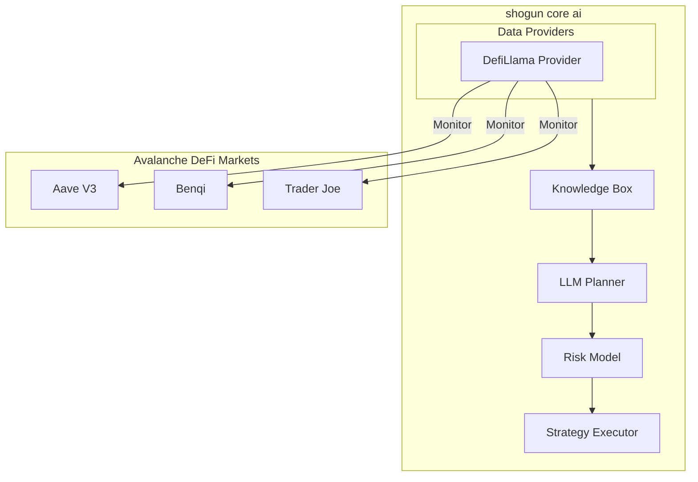
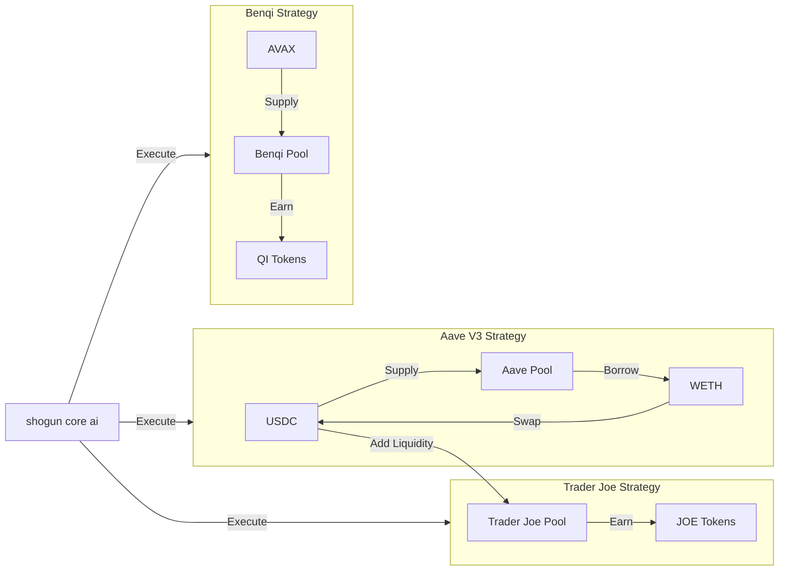
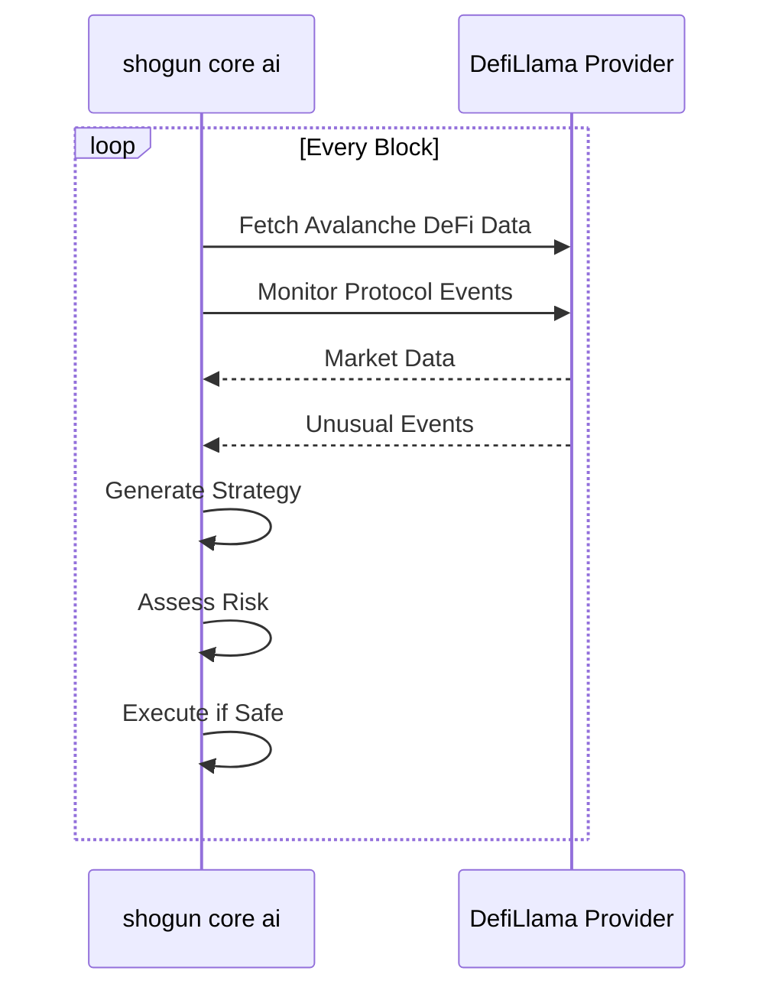
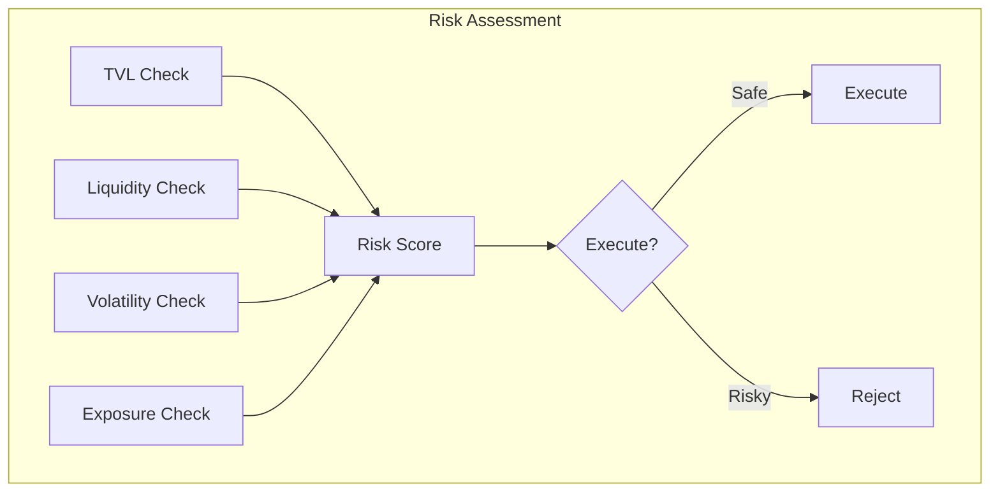
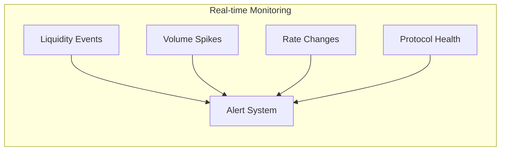
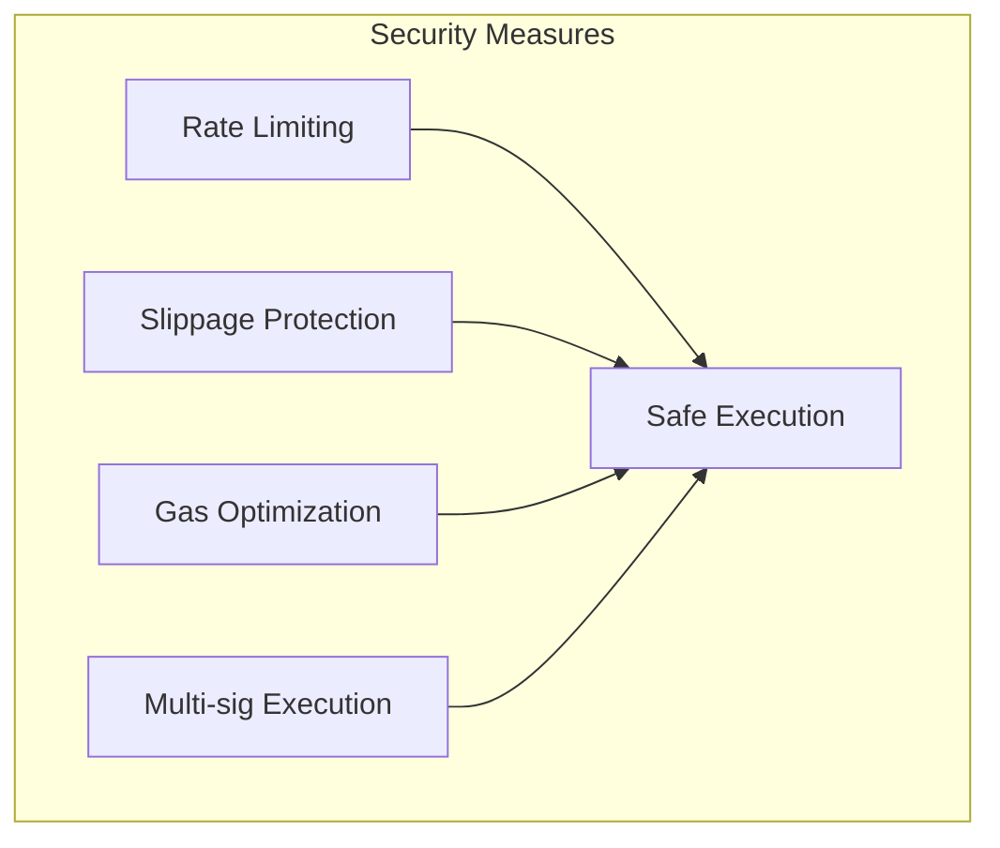

# shogun core ai Architecture

## System Overview

## Strategy Flow

## Data Flow

## Risk Assessment

## Strategy Components

### Aave V3 Strategy
- Monitor lending and borrowing rates on Aave V3
- Track liquidity utilization across pools
- Calculate optimal supply/borrow ratios
- Monitor liquidation risks

### Benqi Strategy
- Monitor Benqi lending protocol rates
- Track QI token rewards and emissions
- Calculate optimal lending positions
- Monitor protocol health metrics

### Trader Joe Strategy
- Monitor Trader Joe DEX liquidity pools
- Track JOE token rewards and farming
- Calculate optimal liquidity provision
- Monitor impermanent loss risks

## Monitoring Parameters

## Configuration

The shogun core ai is configured through `configs/config.yaml` with the following key components:

- RPC endpoints for Avalanche mainnet and Fuji testnet
- Protocol addresses for Aave V3, Benqi, and Trader Joe
- Risk parameters and thresholds
- Monitoring configurations
- LLM settings for strategy generation

## Security Measures

