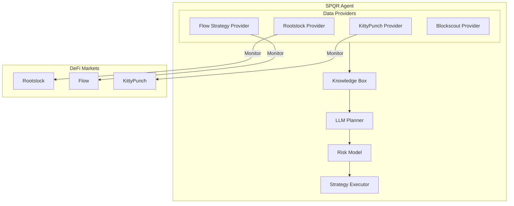
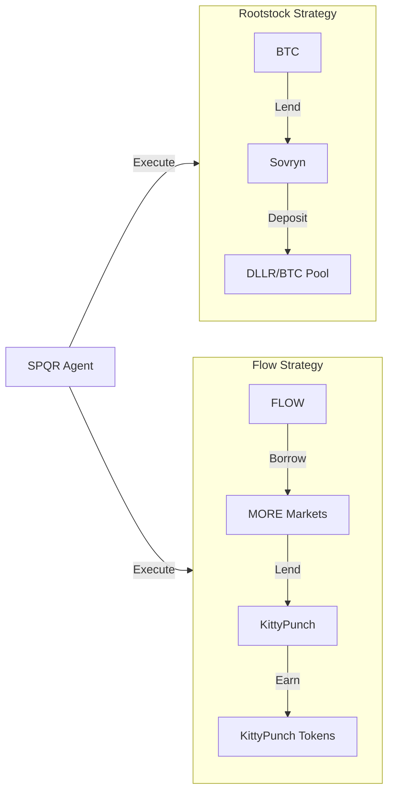
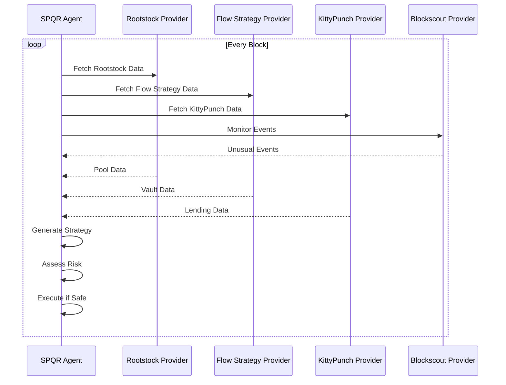
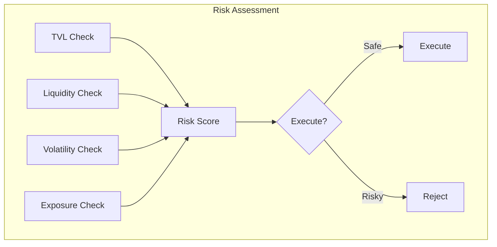
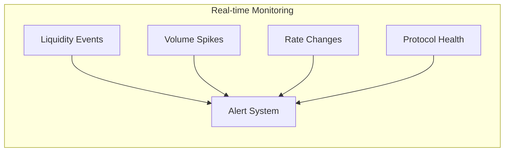
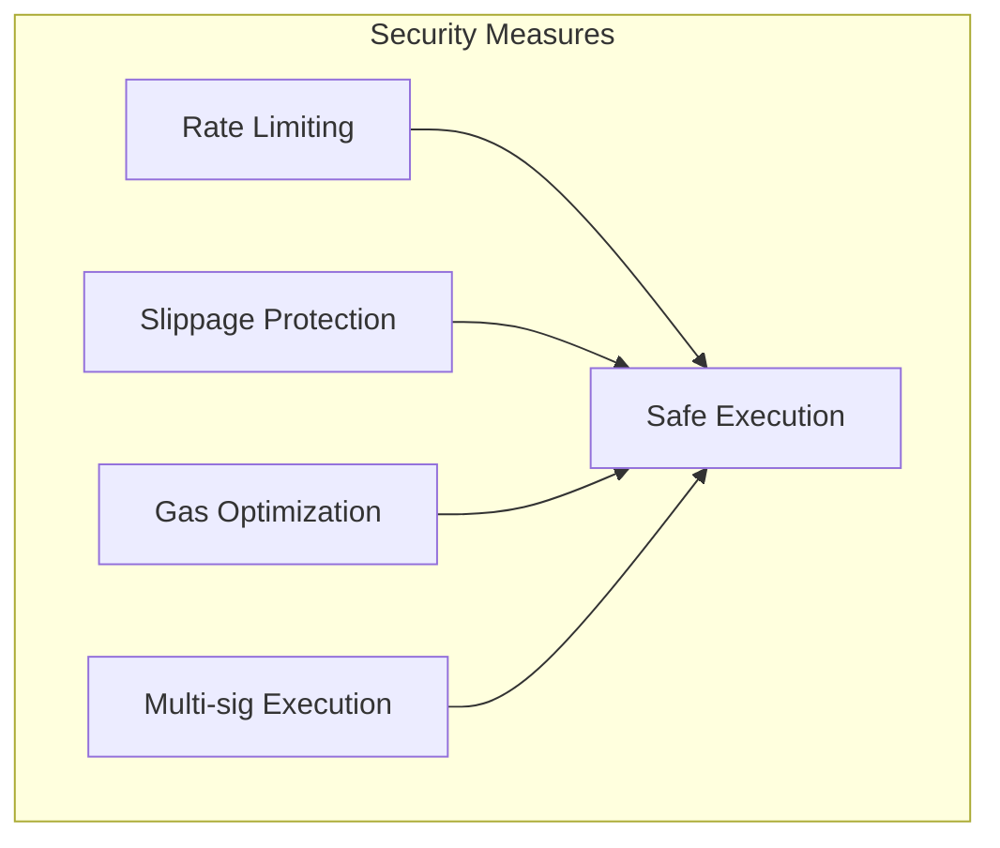

# SPQR Agent Architecture

## System Overview

## Strategy Flow

## Data Flow

## Risk Assessment

## Strategy Components

### Rootstock Strategy
- Monitor BTC lending rates on Sovryn
- Track DLLR/BTC pool liquidity
- Calculate optimal leverage ratios
- Monitor liquidation risks

### Flow Strategy
- Monitor MORE Markets borrowing rates
- Track KittyPunch lending pools
- Calculate token rewards
- Monitor protocol health

## Monitoring Parameters

## Configuration

The SPQR agent is configured through `configs/config.yaml` with the following key components:

- RPC endpoints for Rootstock and Flow
- Protocol addresses for all integrations
- Risk parameters and thresholds
- Monitoring configurations
- LLM settings for strategy generation

## Security Measures

